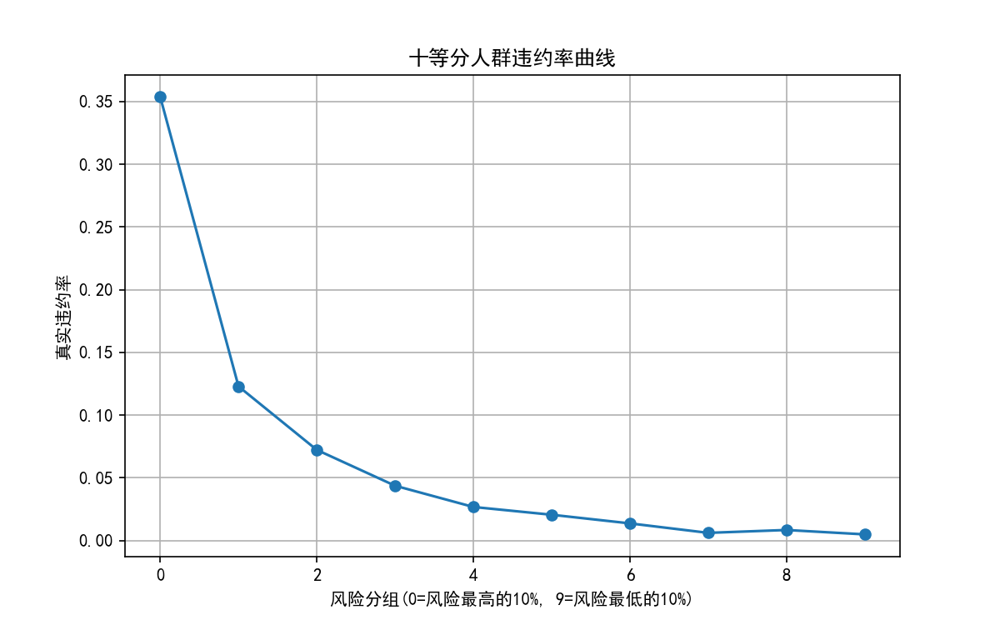

# 信贷风险分析作品集

## 项目结构
- `01_SQL_Risk_Script/` — SQL风险指标计算脚本
- `02_Python_Risk_Model/` — Python评分卡建模代码
- `03_Dataset/` — 数据集说明文档（原始数据未上传，见下方下载方式）
- `04_Project_Report/` — 项目分析报告
- `05_CheatSheet/` — FRM知识点速查

## 数据集获取
本项目使用 Kaggle 公开数据集 [Give Me Some Credit](https://www.kaggle.com/c/GiveMeSomeCredit/data)。
原始CSV文件较大，未上传本仓库，详细字段说明见 `03_Dataset/data_intro.md`，
需要复现代码请自行前往 Kaggle 下载后放入 `03_Dataset/raw/` 目录。

## 项目成果

- 模型效果 — 逻辑回归评分卡，测试集 AUC 0.857，KS 0.562
- 入模特征 — 经 IV 筛选和 VIF 检验，最终保留 7 个特征（VIF 1.07–1.39）
- 评分卡刻度 — 基准分 600，基准 odds 1:20，PDO 20
- 数据泄露修复 — WOE 分箱原本在全量数据上拟合，改为仅基于训练集拟合并保存为 `woe_bins.pkl`，再分别应用到训练集和测试集
- 排序能力 — 风险最高的 10% 人群违约率 35.4%，覆盖测试集 52.5% 的坏客户；最低 10% 人群违约率仅 0.49%

## 技术栈
- DuckDB SQL（风险指标计算）
- Python（pandas / numpy / scikit-learn / scorecardpy，数据清洗与建模）
- FRM Level 1 信用风险理论（PD/LGD/EAD/EL、评分卡开发流程）

## 作者
张元正 Yuanzheng Zhang — Monash University 数据科学研一在读硕士，FRM Level 1 备考中
